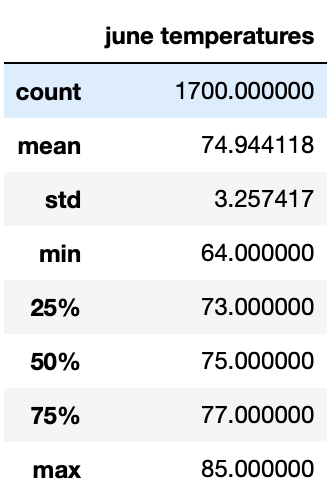
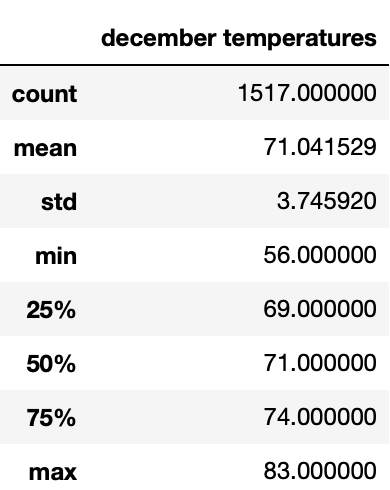
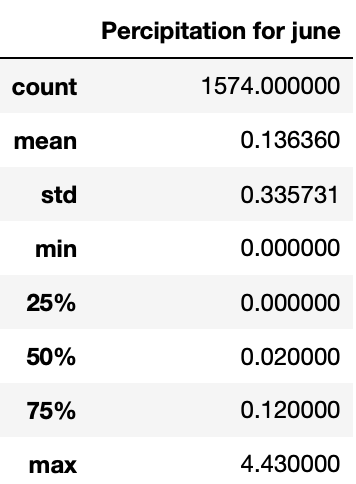
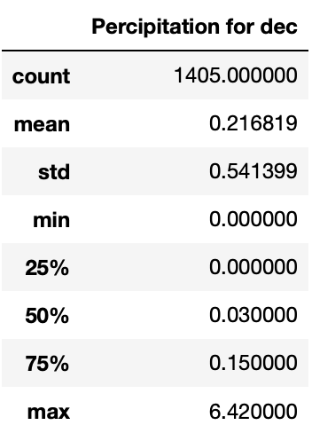

# surfs_up

## Resources
* Python 3.9.0, 
* Anaconda Navigator 1.9.12,
* Jupyter notebook 6.0.3,
* Pandas, NumPy, APIs, Flask, SQLite.

### Project Overview

An analysis on Oahu's weather in order to help determine how seasons affect the island weather. in order to help stakeholders, decide about an upcoming surf and ice cream shop.

### Results

we were tasked with looking at the weather data in the island of Oahu for the months of June and December. these are the temperature details for the 2 months 

* June temperature details 

This data is comprised of 1700 entries. We can also see from the picture that:

1. The average temperature is 74.94 °
2. The minimum temperature is 64 °
3. The maximum temperature is 85 °

* December temperature details 

This data is comprised of 1517 entries. We can also see from the picture that:

1. The average temperature is 71.04 °
2. The minimum temperature is 56 °
3. The maximum temperature is 83 °

### Summary

the results prove that the weather is enjoyable most of the time on the island, so opening a surf shop would be a smart investment knowing that for most months of the year, there will be enjoyable temperature for people to come and use the surf shop.

* For additional analysis, we will look at the precipitation levels for the two months as well. The major takeaways from this analysis are:

1. The average precipitation is 0.136 inches in June
2. The average precipitation is 0.217 inches in December
3. 50% of days in both June and December have less than 0.03 inches of precipitation and 75% have less than 0.15 inches of precipitation
4. The maximum precipitation is 4.43 inches on a single day in June
5. The maximum precipitation is 6.42 inches on a single day in December

you can see the stats in the tables below:

By looking at our analysis result, we can clearly see that there is little amount of precipitation on a normal day, but we still have days with excessive rainfall. This goes to show that the surf shop will be able operate most of the days while a few heavy rain days will help keep the island ecosystem flourishing and inviting to people wanting to visit the surf shop.
